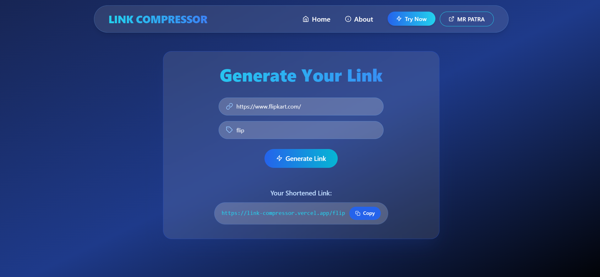

# Link Compressor


A modern, fast, and secure URL shortener built with Next.js and MongoDB. Transform long, messy URLs into sleek, shareable links with custom aliases.

## 🚀 Features

- **Custom Short Links**: Create personalized short URLs (e.g., `your.site/cool-link`).
- **Instant Generation**: Fast and efficient link shortening.
- **Clipboard Integration**: One-click copy functionality.
- **Glassmorphism UI**: A premium, modern interface with smooth animations.
- **Responsive Design**: Works perfectly on desktop and mobile.

## 🛠️ Tech Stack

- **Frontend**: Next.js 15, React 18, Tailwind CSS, Framer Motion
- **Backend**: Next.js API Routes
- **Database**: MongoDB
- **Icons**: React Icons

## 📸 Preview



## 🏁 Getting Started

Follow these steps to set up the project locally.

### Prerequisites

- Node.js installed
- MongoDB database (local or Atlas)

### Installation

1. **Clone the repository**
   ```bash
   git clone https://github.com/amitkumarpatra99/Link_Compressor.git
   cd Link_Compressor
   ```

2. **Install dependencies**
   ```bash
   npm install
   ```

3. **Configure Environment**
   Create a `.env.local` file in the root directory and add your MongoDB connection string:
   ```env
   MONGODB_URI=your_mongodb_connection_string
   NEXT_PUBLIC_HOST=http://localhost:3000
   ```

4. **Run the Server**
   ```bash
   npm run dev
   ```
   Open [http://localhost:3000](http://localhost:3000) to view the app.

## 📁 Project Structure

```
├── app/
│   ├── api/            # Backend API routes
│   ├── Shorten/        # Link generation page
│   └── page.js         # Landing page
├── components/         # Reusable UI components (Navbar, etc.)
├── lib/                # Database connection utilities
├── public/             # Static assets (images, icons)
└── ...
```

## 🔗 API Reference

| Method | Endpoint | Description | Body |
| :--- | :--- | :--- | :--- |
| `POST` | `/api/generate` | Create a new short link | `{ "url": "...", "shorturl": "..." }` |
| `GET` | `/:shorturl` | Redirect to original URL | - |

## 👨‍💻 Author

**Amit Kumar Patra**

---
*Built with ❤️ AMIT KUMAR PATRA*